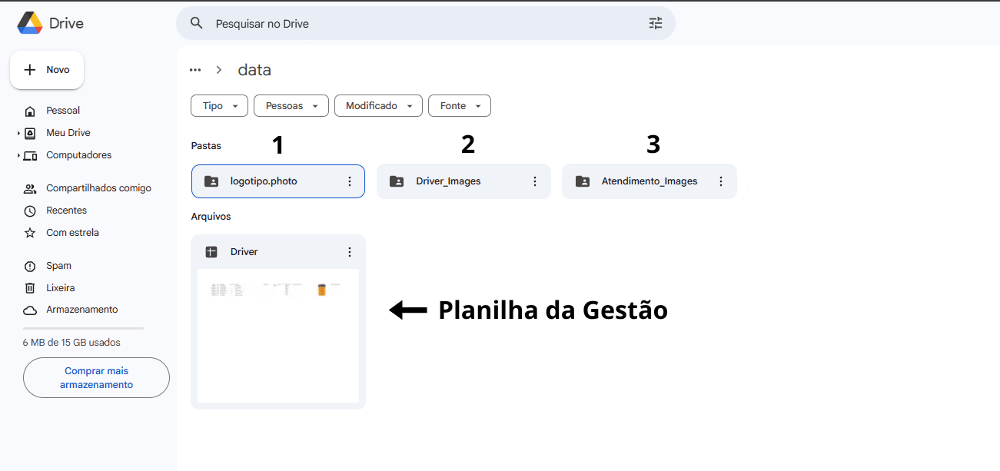
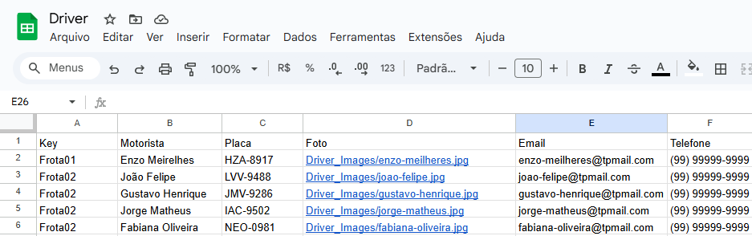
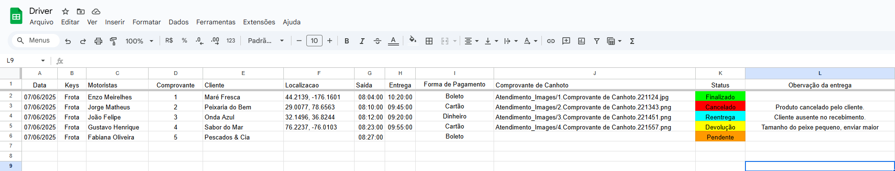
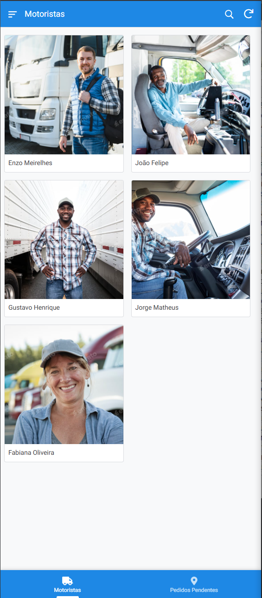
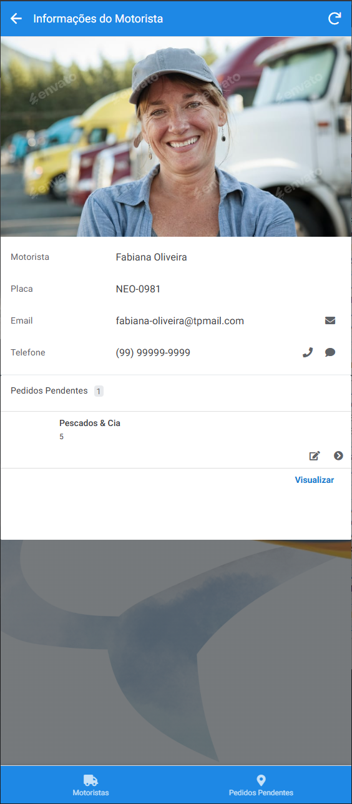
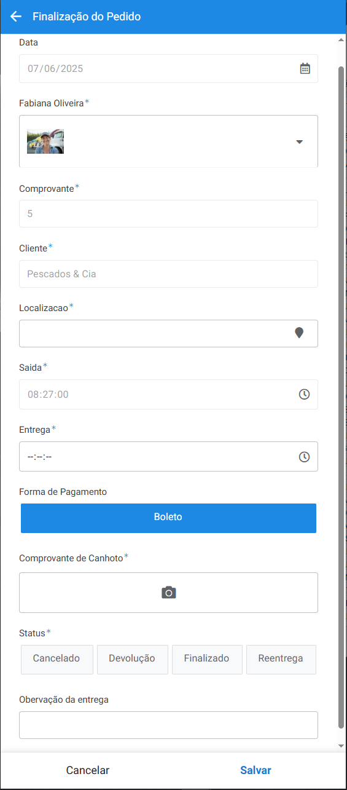

# 🧰 Portfólio No-Code - Bruno Lopes

**📦 Aplicativo de Gestão de Entregas**
Aplicativo desenvolvido para otimizar o controle logístico de entregas, oferecendo uma visualização clara e eficiente de cada etapa do processo. Com uma interface intuitiva e acessível, a ferramenta permite registrar e monitorar:

• Data e hora da saída

• Hora da entrega

• Motorista responsável

• Status do pedido (Pendente, Finalizado, Reentrega, Devolução ou Cancelado.)

• Comprovação com canhoto assinado

• Localização exata da entrega

• Forma de pagamento (pix, dinheiro, cartão, etc.)

A solução foi pensada para empresas que desejam reduzir falhas operacionais, garantir rastreabilidade em tempo real e facilitar a tomada de decisões com base em dados atualizados.

## 🛠️ Ferramentas utilizadas

- **AppSheet** – Criação de aplicativos personalizados.
- **Google Workspace** – Data Base e Planilhas.

## 📅 Data-Base

 

A base de dados do aplicativo é totalmente integrada ao Google Drive, permitindo que todos os arquivos recebidos através do sistema sejam automaticamente armazenados na nuvem. Isso garante segurança, fácil acesso e organização centralizada dos documentos, como comprovantes, assinaturas e registros de entrega.

1- Pasta Relacionada a arquivos de logo da empresa.

2- Pasta destinado a guarda fotos dos motorista responsaveis para entrega.

3- Pasta onde está guardada a fotos dos comprovante de entregas (Canhotos assinados).

## 📋 Planilha da Gestão

A planilha Driver é essencial para o funcionamento do aplicativo, pois centraliza todas as informações utilizadas para alimentar e registrar os dados da operação em tempo real. Ela é composta por duas abas principais: Driver e Job.

📁 Aba: Driver
Contém os dados cadastrais de cada motorista responsável pelas entregas, incluindo:

• Key (identificador único)

• Nome

• Placa do veículo

• E-mail

• Telefone para contato

Essas informações permitem o correto vínculo entre os pedidos e os respectivos motoristas no aplicativo.

📦 Aba: Job
Registra e organiza todos os pedidos, tanto os em andamento quanto os já entregues. Cada linha da planilha representa uma entrega, com os seguintes campos:

• Data da entrega

• Key de identificação

• Motorista responsável

• Número do comprovante (Nota Fiscal)

• Nome do cliente

• Localização da entrega

• Horário de saída do motorista

• Horário de entrega

• Forma de pagamento

• Foto do comprovante (canhoto ou nota)

• Status da entrega

• Observações adicionais

Essa estrutura garante que o processo de entrega seja rastreável, organizado e transparente, facilitando o monitoramento e auditoria de cada etapa da operação.

## 📱 Funcionamento e layout do aplicativo

Quando o motorista for adicionado na planilha "Driver" ele aparecerá no aplicativo para o motorista assim, com todos os motorista já cadastrado.

👤 Seleção do Motorista
Assim que um motorista é cadastrado na planilha Driver, ele passa a aparecer automaticamente na tela inicial do aplicativo, junto aos demais motoristas já registrados.

📋 Visualização dos Dados e Entregas
Ao selecionar o motorista, o aplicativo exibe suas informações pessoais (nome, contato, placa do veículo etc.) e, logo abaixo, uma lista com todas as entregas pendentes atribuídas a ele.

✅ Registro da Entrega
Quando o motorista clica em um pedido que acabou de entregar, ele é redirecionado para um formulário dinâmico, que já vem preenchido com os dados principais do pedido (provenientes da planilha Job).

⚠️ Campos Obrigatórios
Alguns campos no formulário possuem um asterisco *, indicando que são obrigatórios para finalização do processo. Entre eles está o envio da foto do canhoto assinado, que serve como comprovação de entrega. O formulário só pode ser enviado quando todos os campos obrigatórios forem preenchidos corretamente.

## 👨‍💻 Sobre mim

Olá! Meu nome é Bruno Lopes, sou um entusiasta da tecnologia e estou em busca da minha primeira oportunidade profissional como Desenvolvedor Front-End. Estou em constante aprendizado, sempre me atualizando sobre as melhores práticas, ferramentas e linguagens do desenvolvimento web. Atualmente, venho aprofundando meus conhecimentos em HTML, CSS, JavaScript e frameworks modernos, com o objetivo de construir interfaces cada vez mais funcionais e atrativas.

Tenho experiência prática na criação de aplicativos no-code utilizando a plataforma AppSheet, o que me proporcionou uma boa noção de lógica, usabilidade e solução de problemas com foco no usuário. Além disso, sou formado como técnico em manutenção de hardware e redes, o que me dá uma base sólida em infraestrutura, conectividade e suporte técnico.

Busco uma oportunidade onde eu possa crescer junto com a equipe, contribuir com meu esforço, curiosidade e dedicação, e evoluir como profissional da área de tecnologia.

## 📫 Contato

- **Email**: ylordakira@gmail.com  
- **LinkedIn**: https://www.linkedin.com/in/bruno-lopes-768888339/

Obrigado por visitar!
